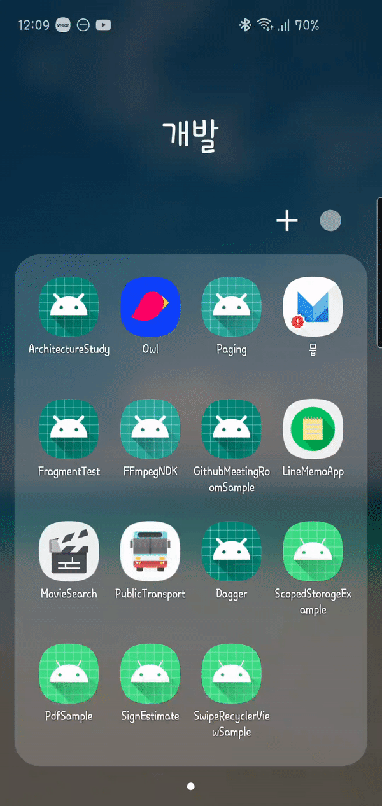

# PdfSample
1. pdf viewer
2. image to pdf
3. pdf rendering

## ScreenShot

## 아키텍쳐

## 적용 기술
### JetPack
- [LifeCycle](https://developer.android.com/jetpack/androidx/releases/lifecycle)
- [DataBinding](https://developer.android.com/jetpack/androidx/releases/databinding)
- [Hilt](https://developer.android.com/jetpack/androidx/releases/hilt)
- [ConstraintLayout](https://developer.android.com/jetpack/androidx/releases/constraintlayout)

### Async
- [RxJava](http://reactivex.io/)

### Image
- [Glide](https://github.com/bumptech/glide)

